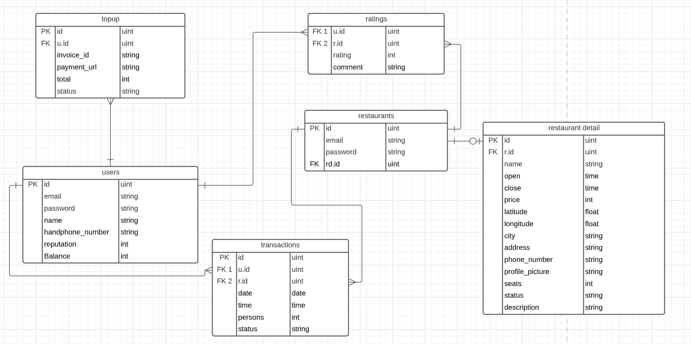

[](https://github.com/labstack/echo)
[](https://pkg.go.dev/gorm.io/gorm?tab=doc)

[](https://github.com/herlianto-github/Restobook/graphs/contributors)

# Restobook

<!-- Description -->
<br/>
<div align="center">
  <a href="https://github.com/herlianto-github/Restobook/IMAGES/Restobook.png">
    
  </a>
</div>
<div>
  <h3 align="center">Restobook</h3>
  <p align="center">
    Online Restaurant Booking
    <br/>
    <a href="https://github.com/herlianto-github/Restobook"><strong>Explore the docs »</strong></a>
    <br/>
    <!-- <br /> -->
    <a href="https://whimsical.com/online-order-QJZTHKQp4jGWeVMxMsmLiX">Wireframe</a>
    ·
    <a href="https://github.com/herlianto-github/Restobook/issues">Report Bug</a>
    ·
    <a href="https://github.com/herlianto-github/Restobook/issues">Request Feature</a>
  </p>
</div>

# Table of Content

- [Description](#restobook)
- [How To Use](HOW_TO_USE.md)
- [How To Contribute](CONRTIBUTING.md)
- [Roadmap](ROADMAP.md)
- [Entity Relationship Model](#entity–relationship-model)
- [Endpoints](#endpoints)
- [Folder Structure](#structuring)
- [Version History](#version-history)
- [Acknowledgments](#acknowledgments)
- [Authors](#authors)

## Entity–relationship model
  <!-- Entity–relationship model -->
  <br/>
  <div align="center">
    <a href="https://github.com/herlianto-github/Restobook/blob/main/ERD/erd_Resto.PNG?raw=true">
      
    </a>
  </div>
  
## Endpoints
[OpenAPI](https://app.swaggerhub.com/apis-docs/Axelworld3/RestoBook/1.0.0)

## Structuring

  ```sh
    Restobook
    ├── configs                
    │     └──config.go           # Configs files
    ├── delivery                 # Endpoints handlers or controllers
    │     └──common
    │     │   ├── global.go           # Constant variable
    │     │   └── http_responses.go   # Default http code, status, message
    │     └──controllers
    │     │   ├── users
    │     │   ├── formatter_req.go    # Default request format for spesific controllers
    │     │   ├── formatter_res.go    # Default response format for spesific controllers
    │     │   ├── users_test.go       # Unit tests for spesific controllers
    │     │   └── users.go            # Spesific controller
    │     └──helpers
    │     │   └── helper.go           # Helper Function
    │     └──routes  
    │         └── routes.go           # Endpoints list
    ├── entities                
    │     └── users.go          # database model
    ├── repository              
    │     ├── interface.go      # Repository Interface for controllers
    │     ├── users_test.go     # Unit test for spesific repository
    │     └── users.go          # Spesific Repository
    ├── utils                 
    │     └── driver.go         # Database driver
    ├── .env                    # Individual working environment variables
    ├── .gitignore              # Which files to ignore when committing
    ├── go.mod                  
    ├── go.sum                  
    ├── main.go                 # Main Program
    └── README.md    
  ```

## Version History

- 0.0.1
  - Endpoint Admin
    - **Register**<br/> /admin/register
    - **Login**<br/> /admin/login
  - Endpoint User
    - **Register**<br/> /users/register
    - **Login**<br/> /users/login
    - **Show User**<br/> /user
    - **Update User**<br/> /user
    - **Delete User**<br/> /user

- 0.0.2
  - Endpoint Restaurant
    - **Register**<br/> /restaurants/register
    - **Login**<br/> /restaurants/login
    - **Show Restaurant**<br/> /myrestaurant
    - **Update Restaurant**<br/> /myrestaurant
    - **Create Restaurant Detail**<br/> /myrestaurant/detail
    - **Update Restaurant Detail**<br/> /myrestaurant/detail
- 0.0.3
  - Third Release
    - coming soon

## Acknowledgments

- [Layered Architecture](https://www.oreilly.com/library/view/software-architecture-patterns/9781491971437/ch01.html)

## Authors

- [Andrew Prasetyo](https://github.com/andrewptjio) (Person In Charge and maintainer)
- [Herlianto](https://github.com/herlianto-github) (Author and maintainer)
- [Ilham Junius](https://github.com/ilhamjunius) (Author and maintainer)
