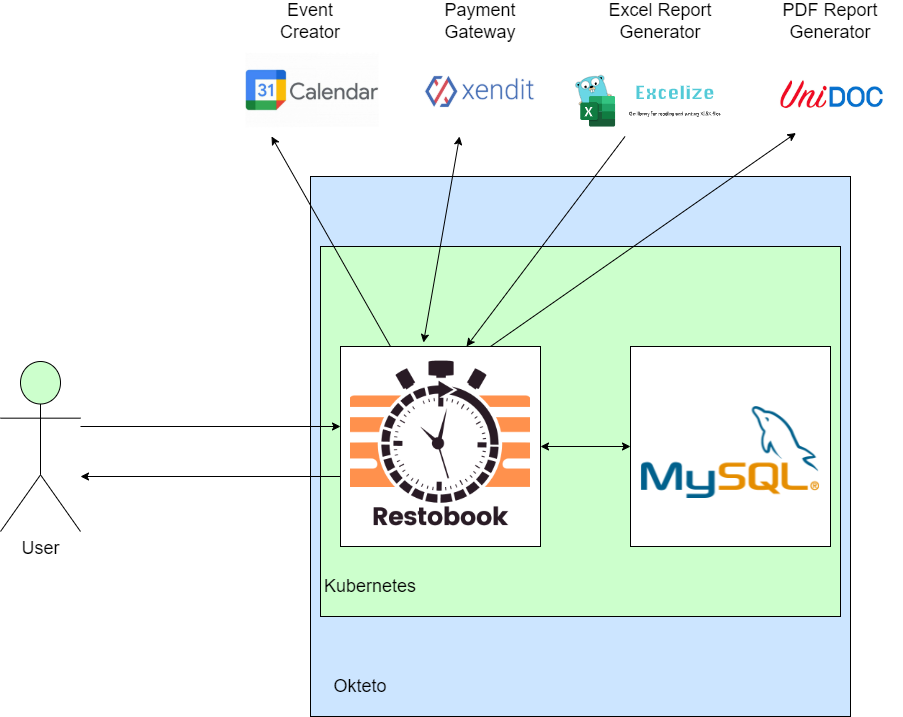
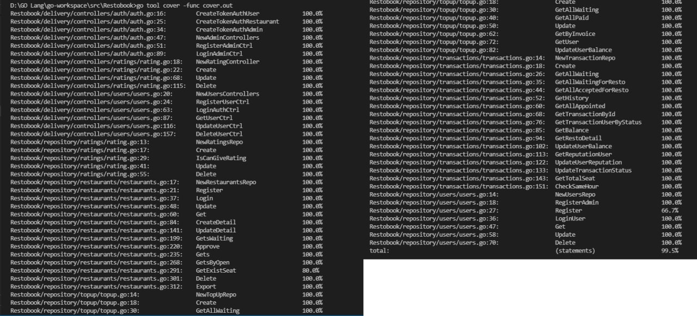
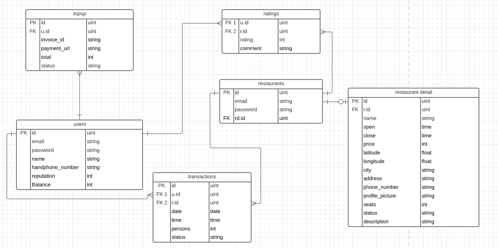

<div id="top"></div>

[](https://github.com/labstack/echo)
[](https://pkg.go.dev/gorm.io/gorm?tab=doc)
[](https://pkg.go.dev/google.golang.org/api@v0.68.0/calendar/v3)
[](https://pkg.go.dev/github.com/unidoc/unipdf/v3)
[](https://pkg.go.dev/github.com/xuri/excelize/v2@v2.5.0)

[](https://github.com/herlianto-github/Restobook/graphs/contributors)

# Restobook

<!-- Description -->
<div align="center">
  <a href="https://github.com/herlianto-github/Restobook/IMAGES/Restobook.png">
    
  </a>
</div>
<div>
  <h3 align="center">Restobook</h3>
  <p align="center">
    Online Restaurant Booking
    <br/>
    <!-- <br /> -->
    <a href="https://whimsical.com/online-order-QJZTHKQp4jGWeVMxMsmLiX">Wireframe</a>
    ·
    <a href="https://github.com/herlianto-github/Restobook/issues">Report Bug</a>
  </p>
</div>

# Table of Content

- [Description](#restobook)
- [How To Use](HOW_TO_USE.md)
- [How To Contribute](CONRTIBUTING.md)
- [Roadmap](ROADMAP.md)
- [High Level Architecture](#high-level-architecture)
- [Test Unit](#test-unit)
- [Entity Relationship Model](#entity–relationship-model)
- [Endpoints](#endpoints)
- [Folder Structure](#structuring)
- [Version History](#version-history)
- [Acknowledgments](#acknowledgments)
- [Authors](#authors)

  <p align="right">(<a href="#top">back to top</a>)</p>

## High Level Architecture
 <!-- High Level Architecture -->  
  <div align="center">
    <a href="https://github.com/herlianto-github/Restobook/blob/main/IMAGES/HLA.drawio.png?raw=true">
      
    </a>
  </div>

  <p align="right">(<a href="#top">back to top</a>)</p>

## Test Unit
<!-- Test Unit -->  
  <div align="center">
    <a href="https://github.com/herlianto-github/Restobook/blob/main/IMAGES/Test_unit.jpeg?raw=true">
      
    </a>
  </div>

  <p align="right">(<a href="#top">back to top</a>)</p>

## Entity–relationship model
  <!-- Entity–relationship model -->  
  <div align="center">
    <a href="https://github.com/herlianto-github/Restobook/blob/main/IMAGES/erd_Resto.PNG?raw=true">
      
    </a>
  </div>

  <p align="right">(<a href="#top">back to top</a>)</p>
  
## Endpoints

[OpenAPI](https://app.swaggerhub.com/apis-docs/Axelworld3/RestoBook/1.0.0)

## Structuring

  ```sh
    Restobook
    ├── configs                
    │     └──config.go           # Configs files
    ├── delivery                 # Endpoints handlers or controllers
    │     └──common
    │     │   ├── global.go           # Constant variable
    │     │   └── http_responses.go   # Default http code, status, message
    │     └──controllers
    │     │   ├── users
    │     │   ├── formatter_req.go    # Default request format for spesific controllers
    │     │   ├── formatter_res.go    # Default response format for spesific controllers
    │     │   ├── users_test.go       # Unit tests for spesific controllers
    │     │   └── users.go            # Spesific controller
    │     └──helpers
    │     │   └── helper.go           # Helper Function
    │     └──routes  
    │         └── routes.go           # Endpoints list
    ├── entities                
    │     └── users.go          # database model
    ├── repository              
    │     ├── interface.go      # Repository Interface for controllers
    │     ├── users_test.go     # Unit test for spesific repository
    │     └── users.go          # Spesific Repository
    ├── utils                 
    │     └── driver.go         # Database driver
    ├── .env                    # Individual working environment variables
    ├── .gitignore              # Which files to ignore when committing
    ├── go.mod                  
    ├── go.sum                  
    ├── main.go                 # Main Program
    └── README.md    
  ```

  <p align="right">(<a href="#top">back to top</a>)</p>

## Version History

- 0.0.1
  - Endpoint Admin
  - Endpoint User
- 0.0.2
  - Endpoint Restaurant
- 0.0.3
  - Endpoint Topup
  - Endpoint Transaction

<p align="right">(<a href="#top">back to top</a>)</p>

## Acknowledgments

- [Layered Architecture](https://www.oreilly.com/library/view/software-architecture-patterns/9781491971437/ch01.html)

<p align="right">(<a href="#top">back to top</a>)</p>

## Authors

- [Andrew Prasetyo](https://github.com/andrewptjio) (Person In Charge and maintainer)
- [Herlianto](https://github.com/herlianto-github) (Author and maintainer)
- [Ilham Junius](https://github.com/ilhamjunius) (Author and maintainer)

<p align="right">(<a href="#top">back to top</a>)</p>
