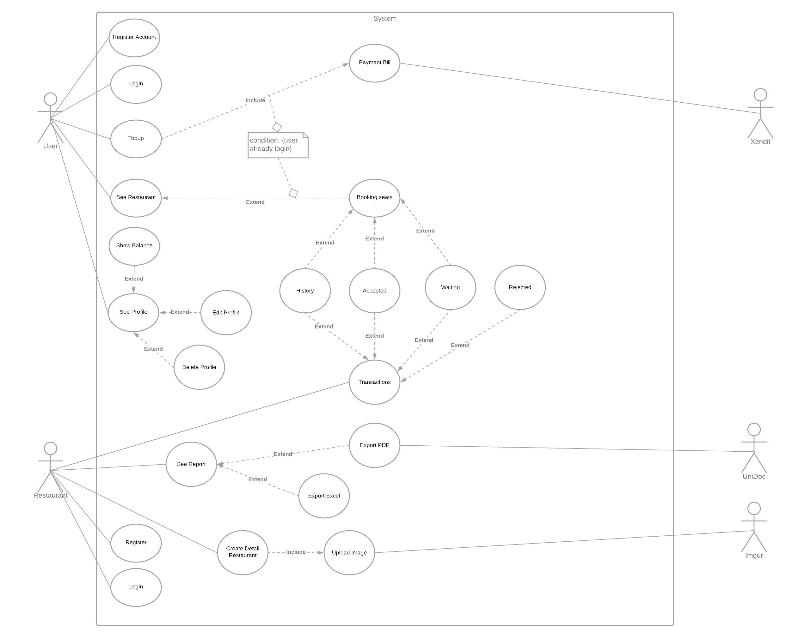
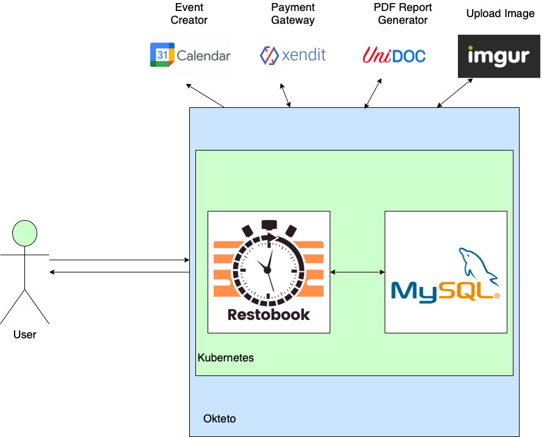
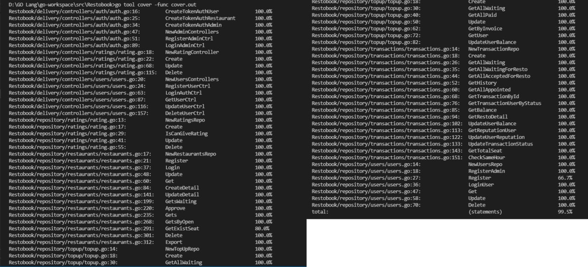

<div id="top"></div>

[](https://github.com/labstack/echo)
[](https://pkg.go.dev/gorm.io/gorm?tab=doc)
[](https://pkg.go.dev/google.golang.org/api@v0.68.0/calendar/v3)
[](https://pkg.go.dev/github.com/unidoc/unipdf/v3)
[](https://pkg.go.dev/github.com/xuri/excelize/v2@v2.5.0)

[](https://github.com/herlianto-github/Restobook/graphs/contributors)

# Restobook

<!-- Description -->
<div align="center">
  <a href="https://github.com/herlianto-github/Restobook/IMAGES/Restobook.png">
    
  </a>
</div>
<div>
  <!-- <h3 align="center">Restobook</h3> -->
  <p align="center">
    Online Restaurant Booking<br/><br/>
    Nowadays, restaurant dont have the assurance whether a customer who booked
    a table will actually come at the booking time or not.
    With this app, restaurant could see the reputation of the user who's trying
    to book a table, and will also get a compensation if the customer failed to
    come at the booking time.
    <br/>
    <!-- <br /> -->
    <a href="https://whimsical.com/online-order-QJZTHKQp4jGWeVMxMsmLiX">Wireframe</a>
    ·
    <a href="https://app.swaggerhub.com/apis-docs/Axelworld3/RestoBook/1.0.0">OpenApi</a>
    ·
    <a href="https://trello.com/b/z6U1sNoh/done">Project Boards</a>
  </p>
</div>

# Table of Content

1. [About The Project](#restobook)
2. [Entity Relationship Model](#entity–relationship-model)
3. [Use Case](#use-case)
4. [High Level Architecture](#high-level-architecture)
5. [Unit Test](#unit-test)
6. [Folder Structure](#structuring)
6. [Technology Stack](#technology-stack)
    - [Backend](#backend)
    - [Programming Language](#programming-language)
    - [Framework](#framework)
    - [Package](#package)
    - [Database](#database)
    - [Testing](#testing)
    - [Collaboration](#collaboration)
    - [Infrastructure](#infra)
8. [How To Use](HOW_TO_USE.md)
9. [How To Contribute](CONRTIBUTING.md)
10. [Acknowledgments](#acknowledgments)
11. [Authors](#authors)
12. [Roadmap](ROADMAP.md)

  <p align="right">(<a href="#top">back to top</a>)</p>

## Entity–relationship model
  <!-- Entity–relationship model -->  
  <div align="center">
    <a href="https://github.com/herlianto-github/Restobook/blob/main/IMAGES/ERD.PNG?raw=true">
      
    </a>
  </div>

  <p align="right">(<a href="#top">back to top</a>)</p>

## Use Case
 <!-- Use Case -->  
  <div align="center">
    <a href="https://github.com/herlianto-github/Restobook/blob/main/IMAGES/Use_Case.png?raw=true">
      
    </a>
  </div>

  <p align="right">(<a href="#top">back to top</a>)</p>

## High Level Architecture
 <!-- High Level Architecture -->  
  <div align="center">
    <a href="https://github.com/herlianto-github/Restobook/blob/main/IMAGES/HLA.png?raw=true">
      
    </a>
  </div>

  <p align="right">(<a href="#top">back to top</a>)</p>

## Unit Test
<!-- Unit Test -->  
  <div align="center">
    <a href="https://github.com/herlianto-github/Restobook/blob/main/IMAGES/Test_Unit.jpeg?raw=true">
      
    </a>
  </div>
Unit Test coverage above 99.5%
  <p align="right">(<a href="#top">back to top</a>)</p>

## Structuring

  ```sh
    Restobook
    ├── configs                
    │     └──config.go           # Configs files
    ├── delivery                 # Endpoints handlers or controllers
    │     └──common
    │     │   ├── global.go           # Constant variable
    │     │   └── http_responses.go   # Default http code, status, message
    │     └──controllers
    │     │   ├── users
    │     │   ├── formatter_req.go    # Default request format for spesific controllers
    │     │   ├── formatter_res.go    # Default response format for spesific controllers
    │     │   ├── users_test.go       # Unit tests for spesific controllers
    │     │   └── users.go            # Spesific controller
    │     └──helpers
    │     │   └── helper.go           # Helper Function
    │     └──routes  
    │         └── routes.go           # Endpoints list
    ├── entities                
    │     └── users.go          # database model
    ├── repository              
    │     ├── interface.go      # Repository Interface for controllers
    │     ├── users_test.go     # Unit test for spesific repository
    │     └── users.go          # Spesific Repository
    ├── utils                 
    │     └── driver.go         # Database driver
    ├── .env                    # Individual working environment variables
    ├── .gitignore              # Which files to ignore when committing
    ├── go.mod                  
    ├── go.sum                  
    ├── main.go                 # Main Program
    └── README.md    
  ```

  <p align="right">(<a href="#top">back to top</a>)</p>

## Technology Stack

### Backend

#### Programming Language

- [Golang (Programming Language)](https://go.dev)

#### Framework

- [Echo (Go web framework)](https://echo.labstack.com)

#### Package

- [Gorm (ORM library)](https://gorm.io)
- [Xendit (Payment gateway)](https://www.xendit.co)
- [Imgur (Image uploader)](https://imgur.com)
- [UniDoc (PDF creator)](https://cloud.unidoc.io)
- [Xuri (Excel creator)](https://xuri.me/excelize/)
- [Google Calendar (Event creator)](https://developers.google.com/calendar/api)

### Database

- [MySQL (Open source database)](https://www.mysql.com)

### Testing

- [Testify](https://pkg.go.dev/github.com/stretchr/testify@v1.7.0)

### Collaboration

- [Trello (Manage projects)](https://trello.com)
- [Github (Cloud-based Git repository)](https://github.com)

### Infra

- [Docker (Container images)](https://www.docker.com)
- [Okteto (Kubernetes platform)](https://www.okteto.com)
- [Kubernetes (Container Orchestration)](https://kubernetes.io)

<p align="right">(<a href="#top">back to top</a>)</p>

## Acknowledgments

- [Layered Architecture](https://www.oreilly.com/library/view/software-architecture-patterns/9781491971437/ch01.html)
- [Scrum Methodology](https://www.scrum.org/resources/what-is-scrum)

<p align="right">(<a href="#top">back to top</a>)</p>

## Authors

- [Andrew Prasetyo](https://github.com/andrewptjio) (Person In Charge and maintainer)
  - [LinkedIn](https://www.linkedin.com/in/andrew-ptjio)
- [Herlianto](https://github.com/herlianto-github) (Author and maintainer)
  - [LinkedIn](https://www.linkedin.com/in/herlianto-%E2%80%8D-829aa284/)
- [Ilham Junius](https://github.com/ilhamjunius) (Author and maintainer)
  - [LinkedIn](https://www.linkedin.com/in/ilham-junius-767b49151)

<p align="right">(<a href="#top">back to top</a>)</p>
